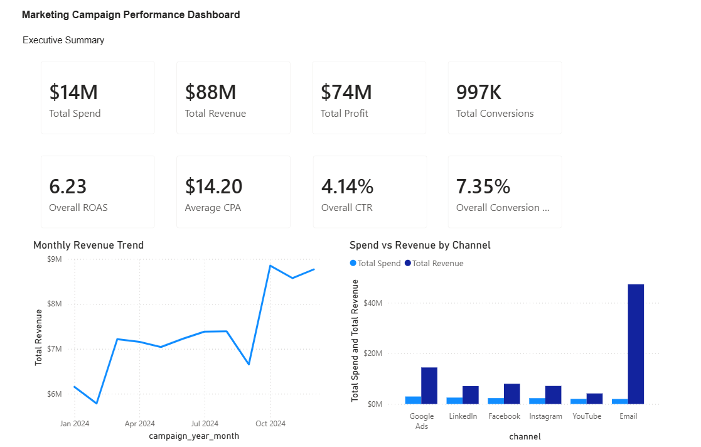
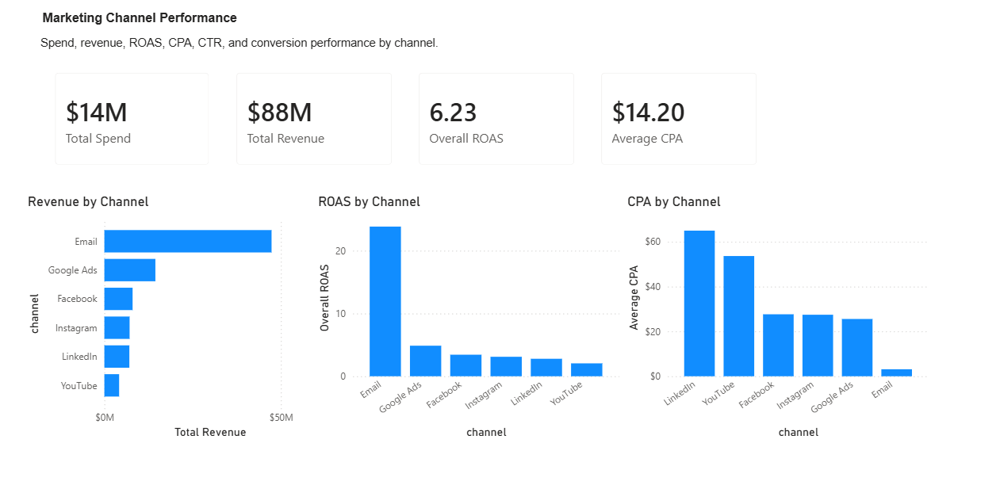
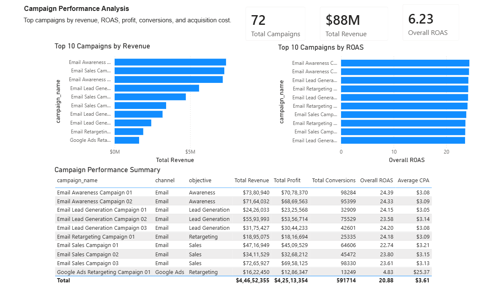
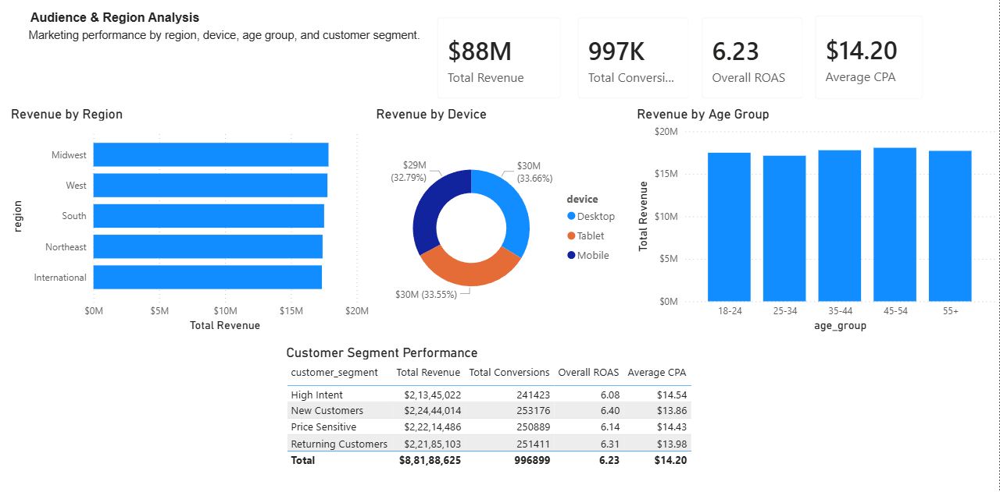

# Marketing Campaign Performance Dashboard

## Project Overview

This project analyzes synthetic marketing campaign performance data to evaluate campaign efficiency, channel performance, customer engagement, acquisition cost, and revenue generation.

The dashboard was built using Python, SQL, SQLite, Power BI, and DAX to track key marketing KPIs such as spend, revenue, profit, conversions, ROAS, CPA, CPC, CTR, and conversion rate.

## Project Status

Completed

## Business Objective

Marketing teams need to understand which campaigns and channels generate the strongest return on investment. This project helps answer:

- Which channels generate the highest revenue?
- Which channels have the strongest ROAS?
- Which campaigns drive the most revenue and profit?
- Which audience segments and regions perform best?
- Which devices contribute most to revenue?
- Where should marketing budget be increased or reduced?

## Tools Used

- Python
- Pandas
- NumPy
- SQL
- SQLite
- Power BI
- DAX
- GitHub

## Dataset

This project uses a synthetic marketing campaign dataset generated with Python.

The dataset includes campaign-level performance across:

- Campaign date
- Campaign ID
- Campaign name
- Channel
- Objective
- Region
- Device
- Age group
- Customer segment
- Impressions
- Clicks
- Spend
- Conversions
- Revenue

Additional calculated KPIs include:

- CTR
- CPC
- Conversion rate
- CPA
- ROAS
- Profit

## Key KPIs

- Total Spend
- Total Revenue
- Total Profit
- Total Conversions
- Total Clicks
- Total Impressions
- Total Campaigns
- Total Channels
- Overall ROAS
- Overall CTR
- Average CPC
- Overall Conversion Rate
- Average CPA

## Dashboard Preview

### Executive Summary



### Channel Performance



### Campaign Performance



### Audience & Region Analysis



## Dashboard Pages

### 1. Executive Summary

The executive summary page provides a high-level view of marketing performance.

It includes:

- Total spend
- Total revenue
- Total profit
- Total conversions
- Overall ROAS
- Average CPA
- Overall CTR
- Overall conversion rate
- Monthly revenue trend
- Spend vs revenue by channel

### 2. Channel Performance

This page compares performance across marketing channels.

It includes:

- Revenue by channel
- ROAS by channel
- CPA by channel
- Spend and revenue comparison

### 3. Campaign Performance

This page identifies the strongest campaigns by revenue, ROAS, profit, conversions, and acquisition cost.

It includes:

- Top campaigns by revenue
- Top campaigns by ROAS
- Campaign performance summary table

### 4. Audience & Region Analysis

This page analyzes performance by geography, device, age group, and customer segment.

It includes:

- Revenue by region
- Revenue by device
- Revenue by age group
- Customer segment performance

## Project Workflow

1. Generate synthetic marketing campaign dataset using Python
2. Clean and prepare campaign data
3. Create calculated marketing KPIs
4. Export processed CSV files
5. Create SQLite database
6. Run SQL analysis queries
7. Generate automated business insights report
8. Build interactive Power BI dashboard
9. Add dashboard screenshots to GitHub README

## Repository Structure

```text
marketing-campaign-performance-dashboard/
│
├── README.md
├── requirements.txt
├── .gitignore
│
├── dashboard/
│   ├── powerbi/
│   │   └── marketing_campaign_performance_dashboard.pbix
│   └── screenshots/
│       ├── executive_summary.png
│       ├── channel_performance.png
│       ├── campaign_performance.png
│       └── audience_region_analysis.png
│
├── data/
│   ├── raw/
│   └── processed/
│
├── reports/
│   ├── business_insights.md
│   └── sql_outputs/
│
├── sql/
│   └── marketing_campaign_analysis.sql
│
└── src/
    ├── generate_marketing_dataset.py
    ├── data_cleaning.py
    ├── create_sqlite_database.py
    ├── run_sql_analysis.py
    └── generate_business_insights_report.py